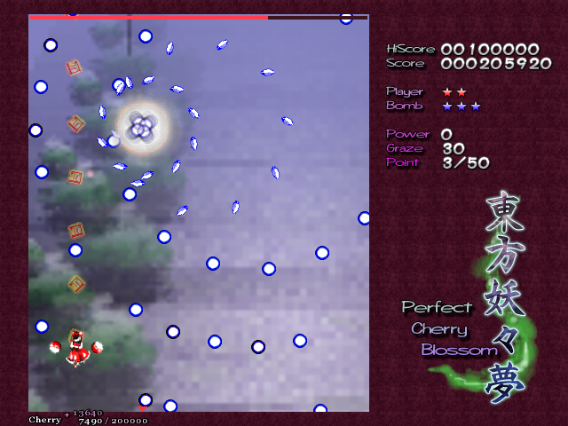

<div align="center">

# 東方エンジン ～ touhou-engine

**少女祈祷中……** 🌸




*通用东方弹幕游戏框架 —— TH07《东方妖妖梦 ～ Perfect Cherry Blossom》为首个接入作品*

</div>

---

## 「Story」这是什么

> 那是，发生在 Python 之上的春雪异变——

引擎逻辑对照原版反编译逐帧移植，对外提供干净的 Pythonic API。
不再是"只能玩"的游戏，而是**可以 import 的幻想乡**：

- 🎮 **完整可玩**：标题菜单 / 选人 / 6 面 + Ex + Phantasm / 符卡宣言 /
  对话立绘 / 3D 背景 / BGM·SE / 结算入榜，pygame 渲染
- 🌊 **事件流 API**：headless 模式逐帧驱动对局，符卡/死亡/Bomb/过关
  全是流式事件——给 AI 训练、自动化、工具链用
- 👀 **观战模式**：`headless=False + auto_input=policy`，窗口里看 AI 打游戏
- 📼 **确定性录像**：种子 + 逐帧输入即可完整复现一局，Replay 菜单可播
- 🔧 **官方魔改口**：`ModApi`（无敌/资源直改/自定义弹幕），不摸引擎内部
- 🧩 **可扩展架构**：作品经 decorator 注册接入，th08 来了照 `games/th07/`
  抄骨架即可，框架零改动

## 「How to Play」安装与运行

```bash
pip install -e .        # 或: uv pip install -e .

touhou07                # 开玩
python -m touhou        # 模块入口亦可
```

依赖：Python ≥ 3.12, numpy, pillow, pygame, loguru, msgspec。

**操作**：方向键移动 ／ `Z` 射击·确认 ／ `X` Bomb ／ `Shift` 低速（显判定点）／
`Ctrl` 快进对话 ／ `Esc` 暂停

**游戏资源**：各作品使用对应原版数据（th07 为 `th07.dat`，BGM 用同目录
`thbgm.dat` 自动推导），运行时解包，**仓库不分发任何二进制资源**。
路径解析顺序：

1. 显式参数（`Game(data_path=...)` / `GameApp(data_path=...)`）
2. 环境变量 `TOUHOU_DAT`
3. 内置默认路径（见 `touhou/paths.py`）

```bash
set TOUHOU_DAT=D:\games\th07\th07.dat   # Windows
export TOUHOU_DAT=/games/th07/th07.dat  # Linux
```

## 「API」像调用库一样玩东方

统一入口 `TouhouWorld`（headless 事件流 / 窗口版游戏）：

```python
from touhou import TouhouWorld, WorldData

wd = WorldData(res_dat=".../th07.dat", bgm_dat=".../thbgm.dat")  # 均可省略走默认解析

tw = TouhouWorld(wd=wd, character="ReimuA",
                 difficulty="Normal", lives=3, headless=True)
stream = tw.run()            # headless: 返回 TouhouWorldEventStream
for event in stream:         # 迭代即驱动世界, 终局自动收尾
    print(event.kind.value, event.name or "")
print(stream.result)         # 迭代结束后: 总结算 dict

tw2 = TouhouWorld(wd=wd, headless=False)
tw2.run()                    # 非 headless: 弹出游戏窗口(阻塞)
```

**观战**（在窗口里看 AI 打游戏）与**录像**：

```python
def my_policy(game) -> Input:   # 逐帧输入策略: 观测面与 Game 门面一致
    return Input(shoot=True, advance=True,
                 left=(game.frame // 90) % 2 == 0)

# 窗口照开, 跳过标题菜单直接进游戏, 每帧输入来自策略而非键盘
# (角色/难度/残机/种子以 TouhouWorld 自身属性为准); Esc 随时中止
tw3 = TouhouWorld(character="MarisaA", difficulty="Normal",
                  headless=False, auto_input=my_policy)
tw3.run()

# headless 流自动录下喂过的每帧输入(engine/replay.py 格式), 存盘后可在
# 窗口版 Replay 菜单播放, 或脚本按 meta 重建逐帧喂回复现
stream.save_replay()           # None → replays/ 下时间戳命名; 返回实际路径
```

**细粒度控制**用 `Game` 门面：

```python
from touhou import Game, Input, GamePhase

game = Game(character="ReimuA", difficulty="Normal", seed=42)
while game.phase in (GamePhase.RUNNING, GamePhase.DIALOG):
    events = game.step(Input(shoot=True, advance=True))
    for ev in events:                       # SPELLCARD_BEGIN/PLAYER_DEATH/...
        print(ev.kind.value, ev.name or "")
print(game.score, game.lives, game.result)  # 结算后 result 非 None
```

- `stream.policy = lambda game: Input(...)` 可随时接管输入（自定义策略/AI）。
- `game.snapshot()` 返回当前帧不可变实体快照（bullets/enemies/items/lasers/
  player/boss，子弹/自机均带判定半径 hitbox）；每帧构造有开销，按需调用。
  躲弹等逐帧热循环用 `game.bullets_array()`（numpy (N,6)：
  x/y/vx/vy/hitbox/sprite，无逐对象装箱）+ `game.player_pos`。
- 属性 `score/lives/bombs/power/cherry/graze/frame/phase/stage/result` 均只读。
- `touhou.types` 是类型门面：集中公共类型别名与结构式 Protocol，供 IDE
  类型提示（运行时请从 `touhou`/`touhou.apis.basic` 导入）。

**魔改**（`ModApi`，官方写入口，与只读的 `Game` 读写分离；分层命名空间）：

```python
from touhou.apis.modding import ModApi

mods = ModApi(tw.game)
mods.player.set_invulnerability_time()  # 无敌(计时每帧递减, policy 里每帧调)
mods.player.set_power(mods.player.full_power)  # 满火力(上限取自作品数值表)
mods.bullets.fire_ring(x, y, arms=24)   # 自定义环形弹幕
mods.player.set_cherry(50000)           # 作品能力(th07 樱点), 并入 player 命名空间
mods.border.border_break()              # 作品注册的新命名空间(th07 结界)
mods.gui.circle(*mods.player.pos, 32)   # 画面覆盖层(立即模式, headless 下 no-op)
mods.available()                        # 分层能力清单: 命名空间 → {能力: 说明}
```

五个通用核命名空间：`player`（无敌/火力/残机/Bomb/坐标）、`boss`
（exists/set_life/set_pos）、`bullets`（fire/fire_ring/clear/count）、
`score`（add）、`gui`（line/circle/polyline/text 覆盖层，坐标系 =
游戏区像素 384x448、y 向下，与 `player_pos`/`bullets_array()` 同系）。

作品专属机制（th07 樱点/结界等）不进 `ModApi` 通用核，由作品包
（`games/th07/mods.py`）经 `@register_mods("th07")` 登记提供者类、
`@mod_namespace("player"/"border")` 声明归属，`ModApi` 构造时按归属收割
（往核心命名空间加方法，或注册整棵新命名空间；重名通用核 fail fast）。

**ECL 编解码**（作品脚本文件的工具链入口）：

```python
from touhou.engine.ecl_codec import EclCodec

codec = EclCodec("th07")                  # 实现从注册表解析
ecl = codec.decode(data)                  # bytes → 作品无关 msgspec.Struct
assert codec.encode(ecl) == data          # 逐字节 round-trip
```

完整示例见 `examples/`：`auto_play.py`（策略开车）、`mod_fun.py`（魔改）、
`dodge_ai.py`（势能场躲弹 baseline，直接运行=窗口观战）。

## 「Architecture」三层架构

作品经注册表接入框架，框架代码零改动：

- **框架层**（`touhou/` 顶层）：作品无关的对外 API（`apis/`）、注册表
  （`registry.py` decorator）、类型门面（`types.py`）、工具与基础设施
  （`utils/`、`exceptions.py`、`paths.py`、`env.py`、`logger.py`）。
- **引擎层**（`touhou/engine/`）：跨作品可复用机制 —— ECL 虚拟机基类、
  Player/Bomb/Globals/Item/Boss 基座、弹幕/激光/敌人宿主，
  以及 `render/`（Renderer 协议 + D3DX-like 管线接口）与 `view/`
  （作品无关渲染基建）。
- **作品层**（`touhou/games/th07/`）：TH07 的全部具体实现（对局主逻辑/
  自机/符卡/炸弹/道具/ECL VM/数值表/表现层），在 `import touhou` 时
  经 decorator 完成全维度注册 —— 也是接新作品时照抄的骨架。

## 「Extend」接入新作品

接新作品（th08…）的姿势：照 `games/th07/` 抄一套骨架，组件在定义处用
decorator 注册即可。`touhou.registry` 是框架与作品的接缝。注册维度：

- `@register_ecl(name, file_format=...)` — ECL 虚拟机（指令集解释器类 + ecldata 解析类）
- `@register_anm(name, version=...)` — ANM 格式变体（解析类 + 版本号）
- `@register_game_hooks(name, stage_file=..., ecl_file=..., msg_file=...)` —
  游戏回调包（EclHost 宿主实现类 + 关卡资源命名规则）
- `@register_world_impl(name)` — 对局主逻辑类，`TouhouWorld(game=name)` 经此构造
- `register_game_data(name, GameData)` — 数值表/名单（符卡分值/炸弹参数/
  掉落表/火力档/机体 sht 映射/角色与难度名单），构造对局时经 `data=` 注入
- `@register_app(name)` — 窗口 App（非 headless 入口，契约见 registry docstring）

同一维度同名重复注册报 `ValueError`（防静默覆盖）；查找未注册名报带已注册
列表的 `KeyError`。门面只面向 `touhou.types.GameEngine` 协议编程，对局实现
鸭子满足该协议即可，无需 adapter；符卡/对话等作品专属探测走可选方法
`spellcard_active()`/`msg_active()`（不实现则门面按 False 回落）。

以假想的 th99 为例的骨架：

```python
from touhou.registry import (
    GameData, register_anm, register_ecl, register_game_data,
    register_game_hooks, register_world_impl,
)
from touhou.engine.ecl import EclFile, EclHost
from touhou.engine.ecl_base import EclMachineBase

@register_ecl("th99", file_format=EclFile)     # 指令集不同就换自己的 Machine/File
class Th99EclMachine(EclMachineBase): ...      # 基类只定契约, opcode 用 @register 登记

@register_anm("th99", version=2)
class Th99AnmFile(...): ...

@register_game_hooks("th99", stage_file="st{n}.std")   # 自己的资源命名规则
class Th99EclHost(EclHost): ...

register_game_data("th99", GameData(           # 自己的数值表(可复用 th07 子集)
    characters=(...), difficulties=(...), character_sht={0: ("p0.sht", "p0s.sht")},
    spellcard_scores=(...), drop_table=(...)))

@register_world_impl("th99")   # 构造契约见 registry 模块 docstring
class Th99Game: ...            # 鸭子满足 GameEngine 协议; 也可直接复用 th07 引擎

tw = TouhouWorld(game="th99", headless=True)   # 从注册表解析
```

最小路径（只换数据/资源，不改引擎）：复用 `PerfectCherryBloom` 作对局实现，
只注册自己的 `GameData` —— 示例见 `tests/game_test/th07/test_th07_registry.py`
的 `test_stub_game_with_custom_data_reuses_th07_engine`。

## 「Package」包结构

- `touhou/apis/` — 对外门面：`basic.py`（Game/TouhouWorld/事件流）、
  `modding.py`（ModApi 魔改口）
- `touhou/types.py` / `registry.py` — 类型门面、作品注册表
  （渲染后端维度：`register_renderer`，默认 "pygame"）
- `touhou/games/th07/` — th07 游戏逻辑包：`world.py`（对局主逻辑
  PerfectCherryBloom）、`player.py`（自机）、`boss.py`（符卡）、`bomb.py`
  （炸弹+结界）、`items.py`（道具经济）、`globals.py`（樱点/计数）、
  `results.py`（评级）、`ecl_host.py`（ECL 宿主钩子）、`ecl_vm.py`
  （EclMachineTh07 + opcode handler）、`playerdata.py`、`data.py`
  （数值表，单一来源）、`view/`（GameApp 应用壳/菜单场景/HUD/战斗画面/
  PygameRenderer 后端）
- `touhou/engine/` — 跨作品机制：`ecl.py`（ECL 状态结构）、`ecl_base.py`
  （VM 框架基类）、`ecl_codec.py`（EclCodec 编解码入口）、`bullets.py` /
  `bullet_commands.py` / `lasers.py`（弹幕/激光原语）、`enemies.py`、
  `player_base.py` / `bomb_base.py` / `boss_base.py` / `globals_base.py` /
  `item_base.py`（各系统基座）、`ending.py`（结局脚本）、`rng.py`
  （确定性随机）、`replay.py` / `config.py` / `score_store.py`、
  `render/`（Renderer 协议 + FrameInput + D3DX-like 管线）、`view/`
  （anm 脚本 VM/特效层/.std 3D 背景/SpriteBank/SoundPlayer/震屏）
- `touhou/schema/` — 资源格式解析（dat/anm/std/ecl/sht/msg/thbgm 等）

## 「Test」

```bash
SDL_VIDEODRIVER=dummy SDL_AUDIODRIVER=dummy uv run python -m pytest -q
```

测试分两层：`tests/` 根下是通用层测试（只用 `tests/conftest.py` 注册的
假作品 `test00`，禁止 import `games.*`，AST 守护钉死）；`tests/game_test/th07/`
是 th07 专属测试（文件名统一 `test_th07_` 前缀，用真实 th07.dat 数据，
默认路径或 `TOUHOU_DAT` 指向）。未来作品即 `game_test/th08/test_th08_*.py`。

---

<div align="center">

🌸 *原作《东方妖妖梦 ～ Perfect Cherry Blossom》© 上海アリス幻樂団（ZUN）* 🌸

*本仓库为爱好者再实现/二次创作，不含亦不分发任何原版游戏资源；*
*反编译参考来自 [some100/th07](https://github.com/some100/th07)（100% 实现 / 99.78% 精度）。*

**少女已祈祷完毕 —— 弹幕，就绪。**

</div>
